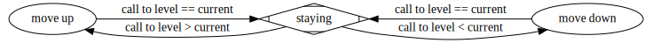

# Elevator

## The Challenge

You need to make a [graph](https://en.wikipedia.org/wiki/Graph_(discrete_mathematics)) that describes the movement mechanism of the elevator.
Elements of the elevator system:
 - **Cabin** that can move up or down
 - Upper and lower **sensors** on the floor showing the position of the elevator
 - **Buttons** on the floors to call the elevator
 - **Buttons** inside the сabin to select the floor

## Subtasks

- [x] Create elevator graph
- [ ] Realize graph functionality
- [ ] Create GUI

## Graph

To convert .dot file to .svg use:

```
dot -Tsvg graph.dot > graph.svg
```

